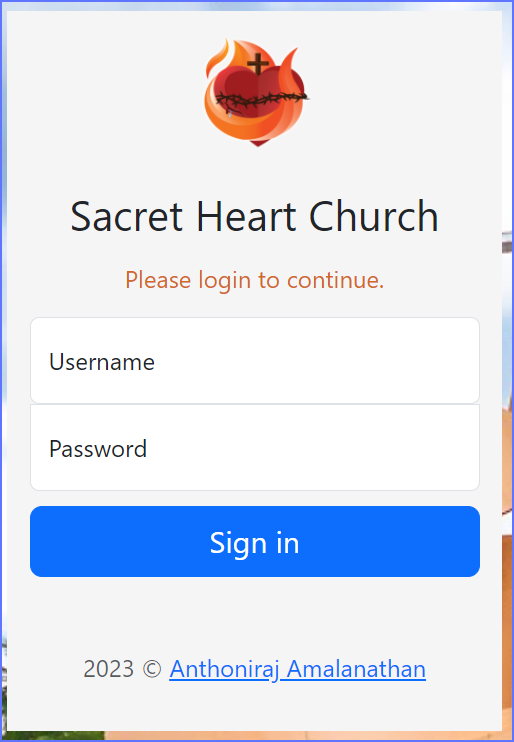
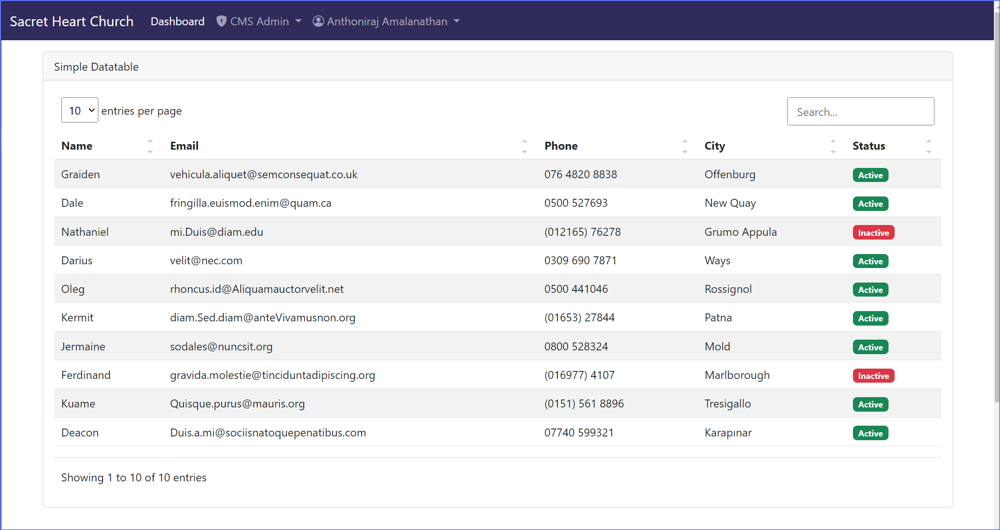
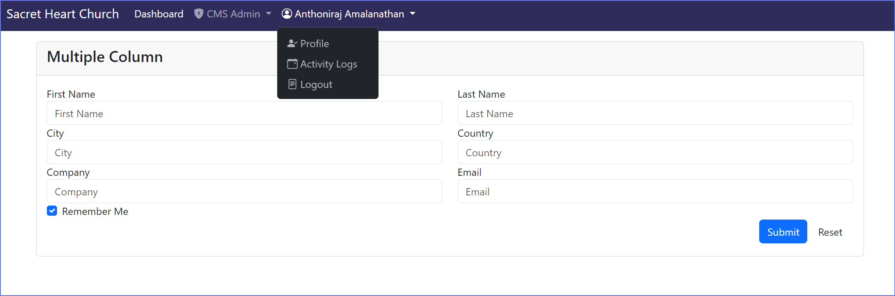
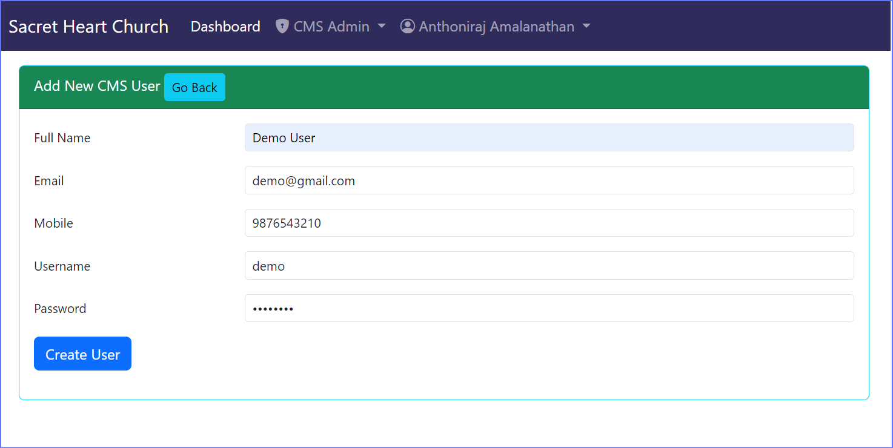

# Flask Startup Project for Developer
- Author: Anthoniraj Amalanathan

## Setting up the environment (For Windows)
- Install Python3 from the official website: https://www.python.org/downloads/windows/
- Select the `Add to PATH` option during installation
- After installing python, Create a Virtual Environment in Command Prompt `python -m venv church`
- Now Activate the Virtual Enviroment `church\Scripts\activate`

## Install the following libraries
```bash
    pip install flask flask_wtf flask_bcrypt flask_login flask_sqlalchemy 
```
- `flask`: Main Flask Module
- `flask_wtf`: For CSRF Protection
- `flask_bcrypt`: For Password Encryption
- `flask_login`: For Login Management
- `flask_sqlalchemy`: For Object Relational Mapping (ORM)

## Setup Visual Studio Code
- Open the Project Folder in VS Code 
- Select the Virtual Environment (from Bottom right corner Python Option)
- Open new terminal in VSCode (you must be able to see the vnv here)
- Now run the setup.py to create user table and admin accounts
    - `python setup.py`
- After successfull creation of database, table, and users, start the flask app
    - `python main.py`
- Now, Navigate the following URL in web browser
    - http://127.0.0.1:5000
- Use the login credetianls at the time of creating user account

## Features
- Authentication (Login and Logout Page with users table (ORM) )

- Bootstrap5 Frontend Pages with responsive forms and datatables

- Horitonzal Navbar with Dropdown Menus

- Simple HTML Flask Template System
- DB CRUD Operations with ORM and Forms
- User Add Screen
    
- User Details, Update, and Delete
    ![Navbar](./static/images/05_crud.png

